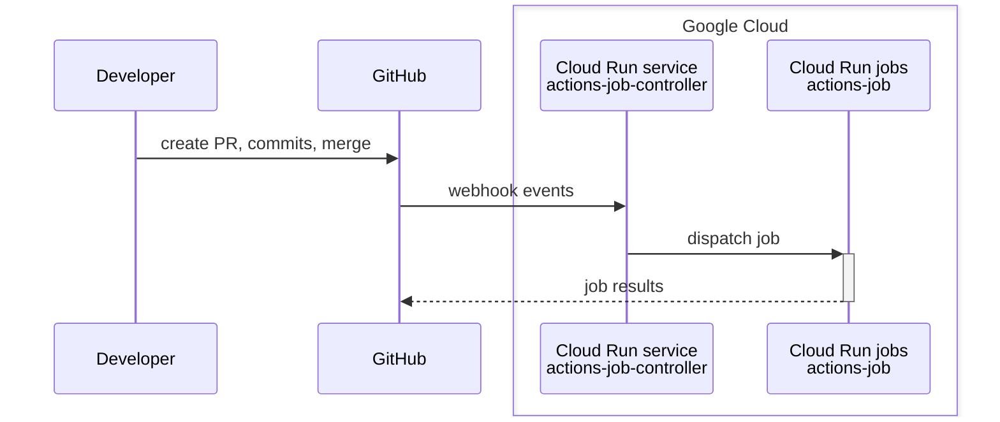

# actions-job

Self-Hosted GitHub Actions Runner on Google Cloud Run Jobs.

## Links

- docs.github.com
    - [Hosting your own runners](https://docs.github.com/en/actions/hosting-your-own-runners)
    - [About webhooks](https://docs.github.com/en/webhooks-and-events/webhooks/about-webhooks)
    - [Webhook events and payload](https://docs.github.com/en/webhooks-and-events/webhooks/webhook-events-and-payloads)
    - [Security hardening for GitHub Actions](https://docs.github.com/en/actions/security-guides/security-hardening-for-github-actions#hardening-for-self-hosted-runners)
- Related projects
    - [actions/actions-runner-controller](https://github.com/actions/actions-runner-controller) - *Kubernetes controller for GitHub Actions self-hosted-runners*
- docker.com
  - https://docs.docker.com/engine/security/rootless/
